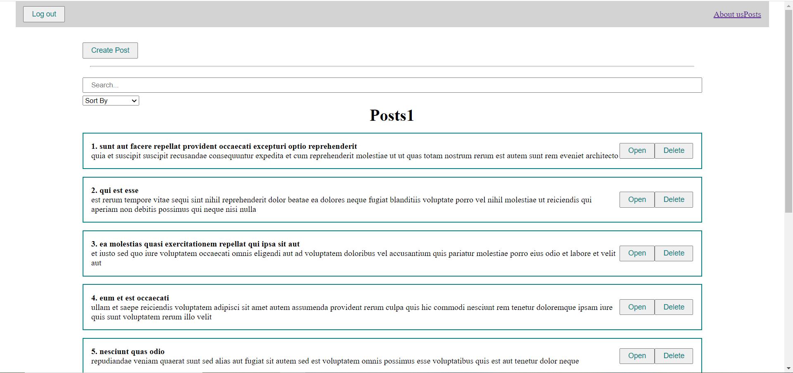

# Application - "POSTS", react

> The main goal of this project is to show the logic of component interaction and consolidation of knowledge

## **Features are implemented:**

- Adding posts
- Filter and find posts
- Modal window to add post
- User authentication
- Fetch data from server
- Custom hooks
- Custom UI components
- Pagination

## **Application UI:**

### **Main**

### **Modal window to add post**
